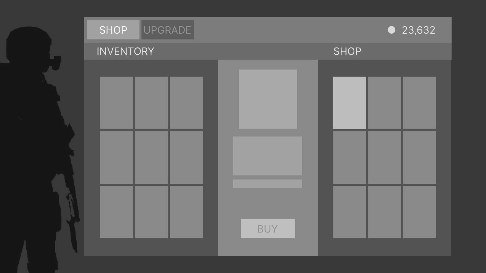
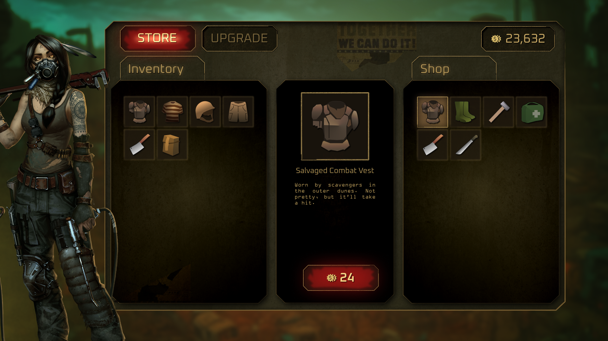
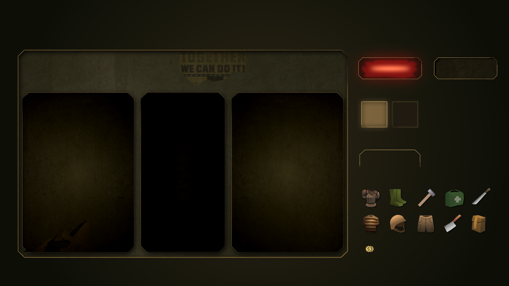

# 🛒 Post-Apocalyptic Shop UI – #uipeepschallenge

A UI/UX design case study for a shop/store interface in a post-apocalyptic action-adventure game. Created as part of the May–June 2025 #uipeepschallenge.

## 🔥 Concept

Design a rugged and immersive shop UI where players can buy, sell, trade, and upgrade weapons, gear, and survival supplies in a wasteland setting.

## 🧰 Features

- Buy, Sell, Trade, and Upgrade screens
- Thematic UI design: distressed, utilitarian, survivalist
- Icons, currency, item cards

## 🖼️ Screenshots

  
*Wireframe layout showing resources, controls, and player progress.*


*Set of sci-fi icons and UI designed for trade, sell menus.*

  
*Game icons and components.*

## 🧱 Tools Used

- Figma (UI layout, components)
- Photoshop (asset polishing)
- Fonts: Orbitron
- Icons: Custom-designed

## 📁 Repo Structure

```
PostApocalyptic-Shop-UI/
├── assets/           # Fonts, images, icons
├── docs/             # Presentation text or export
├── screens/          # Final screenshots and mockups
├── source/figma/     # Editable files or exports from Figma
└── README.md         # Project summary and structure
```

## 📌 Author

Designed by Anoop Anto • [behance.net/anoopanto](https://www.behance.net/anoopanto)

---

Inspired by the Resident Evil 4 shop system. Source: [Game UI Database](https://www.gameuidatabase.com/uploads/Resident-Evil-4-202303282023-040323-33014.jpg)
